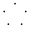

まだ全然終わらせてないけど 😅

<!-- BEGIN -->

## 2023

|Day|Solutions|
|-|-|
| 01 |  |
| 02 |  |
| 03 |  |
| 04 |  |
| 05 |  |
| 06 |  |

## 2022

|Day|Solutions|
|-|-|
| 01 |  |
| 02 |  |
| 03 |  |
| 04 |  |
| 05 |  |
| 06 |  |
| 07 |  |
| 08 |  |
| 09 |   |
| 10 |  |

## 2021

|Day|Solutions|
|-|-|
| 01 |    |
| 02 |    |
| 03 |   |
| 05 |  |
| 06 |  |

## 2020

|Day|Solutions|
|-|-|
| 01 |      |

## 2019

|Day|Solutions|
|-|-|
| 01 |  |
| 02 |  |
| 03 |  |

<!-- END -->
